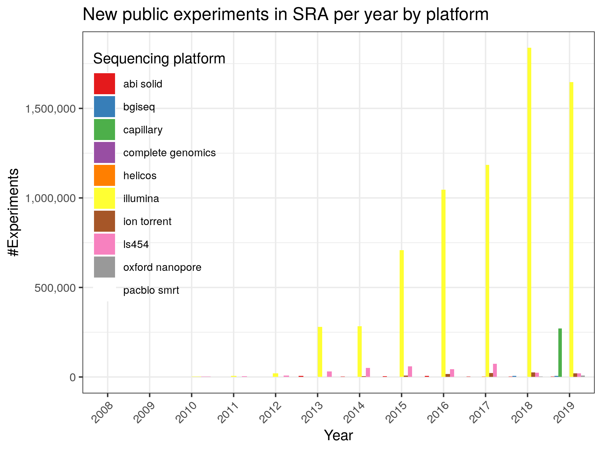

# sequencing-technology-usage-diagram
Visualisation of sequencing platform data in SRA over the time

Required nextflow and docker. You need to build the docker image with the required r packages yourself.

## Results until 2008-2019

By platform:

By sample source:

Combined:

